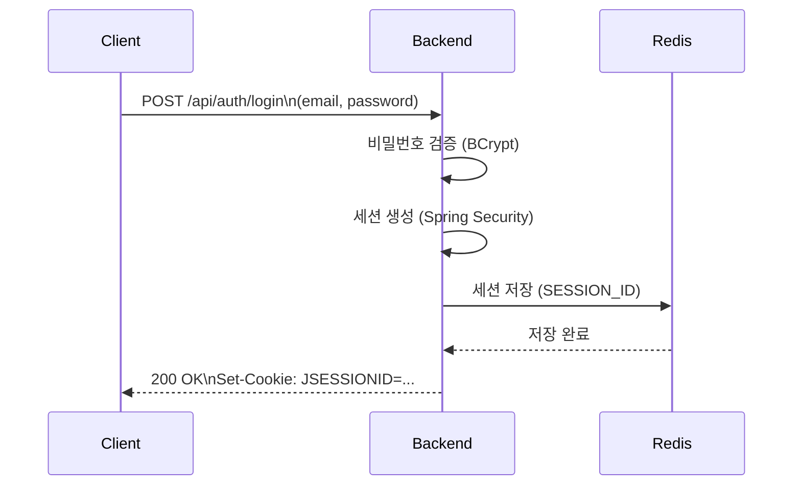
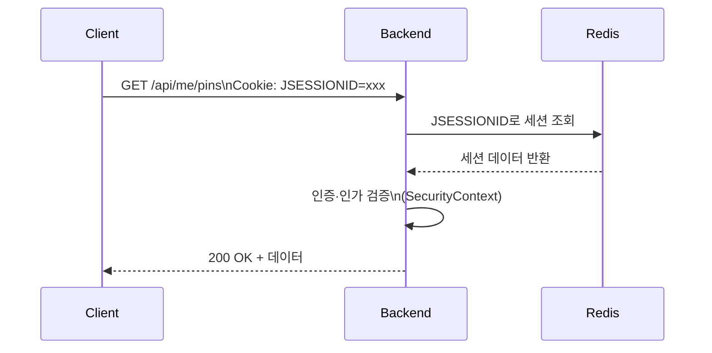
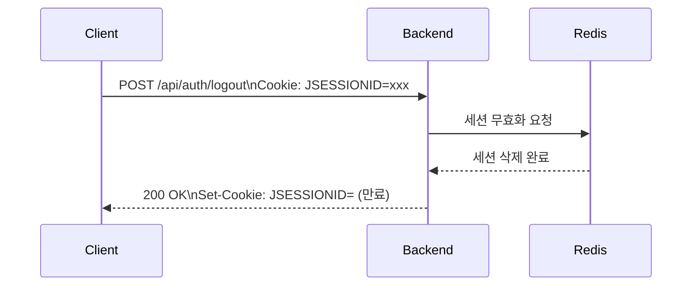

# 인증 설계 문서

> PRD 3.1(회원 시스템), 4.1.3(Redis 활용), RULE 1.2(인증·인가), 2.4(세션 스토리지) 기준.

## 1. 개요

| 항목 | 내용 |
|------|------|
| 인증 방식 | 세션·쿠키 기반 |
| 세션 저장소 | **Redis** (Spring Session Redis) |
| 역할 | ROLE_USER, ROLE_ADMIN |
| 확장 고려 | OAuth2 (Google/Kakao/Naver) |

---

## 2. 인증 흐름

### 2.1 로그인 흐름

### 2.2 인증된 요청 흐름

### 2.3 로그아웃 흐름

---

## 3. 세션·쿠키 설정

### 3.1 세션 설정 (Redis)

| 항목 | 값 | 설명 |
|------|-----|------|
| 저장소 | Spring Session Redis | `spring-session-data-redis` |
| 네임스페이스 | `spring:session:sessions:` | Redis 키 접두사 |
| 만료 | 30분 (비활성) | `server.servlet.session.timeout` |
| 최대 비활성 간격 | 30분 | Redis 세션 TTL과 동기화 |

### 3.2 쿠키 설정

| 항목 | 값 | 설명 |
|------|-----|------|
| 이름 | JSESSIONID | Spring 기본값 |
| HttpOnly | true | XSS 방지 |
| Secure | true (운영) | HTTPS 전송만 |
| SameSite | Lax 또는 Strict | CSRF 완화 |

---

## 4. 인증·인가 경로 매핑

### 4.1 비인증 허용 경로

| 경로 | 용도 |
|------|------|
| `/api/members` (POST) | 회원가입 |
| `/api/auth/login` (POST) | 로그인 |
| `/api/posts` (GET) | 게시글 목록·상세 |
| `/api/image-posts` (GET) | 이미지 게시글 목록·상세 |
| `/api/pins/nearby` (GET) | 반경 내 Pin 조회 |
| `/actuator/health`, `/actuator/info` | 헬스체크 |
| `/swagger-ui/**`, `/v3/api-docs/**` | API 문서 |

### 4.2 인증 필수 경로

| 경로 | 용도 |
|------|------|
| `/api/auth/logout` (POST) | 로그아웃 |
| `/api/auth/me` (GET) | 현재 사용자 조회 |
| `/api/posts` (POST), `/api/posts/{id}` (PUT, DELETE) | 게시글 작성·수정·삭제 |
| `/api/image-posts` (POST), `/api/image-posts/{id}` (PUT, DELETE) | 이미지 게시글 CRUD |
| `/api/pins` (전체), `/api/pins/{id}` (PUT, DELETE) | Pin CRUD |
| `/api/me/**` | 마이페이지 전용 |

### 4.3 관리자(ROLE_ADMIN) 전용 경로

| 경로 | 용도 |
|------|------|
| `/api/admin/**` | 회원 관리, 게시물 관리, 통계 |

---

## 5. 역할(Role) 정의

| 역할 | 설명 | 권한 |
|------|------|------|
| ROLE_USER | 일반 회원 | 게시글/Pin 작성·수정·삭제, 마이페이지 |
| ROLE_ADMIN | 관리자 | 전체 회원·게시물 관리, 통계, 공지 등록 |

---

## 6. OAuth2 확장 포인트

향후 SNS 로그인(Google/Kakao/Naver) 확장 시 고려할 확장 포인트:

### 6.1 엔드포인트

| 엔드포인트 | 용도 |
|------------|------|
| `GET /oauth2/authorization/{provider}` | OAuth2 로그인 시작 (provider: google, kakao, naver) |
| `GET /login/oauth2/code/{provider}` | OAuth2 콜백 (Spring Security OAuth2 Client) |
| `POST /api/auth/oauth2/link` | 기존 계정과 OAuth2 연동 (선택) |

### 6.2 역할·연동

| 항목 | 설명 |
|------|------|
| OAuth2 성공 시 | 기존 세션·쿠키 방식과 동일하게 Redis 세션 생성 |
| OAuth2 사용자 | ROLE_USER 부여, 별도 회원가입 없이 최초 로그인 시 계정 생성 |
| 이메일 중복 | OAuth2와 기존 이메일/비밀번호 계정 동일 이메일 시 연동 또는 충돌 정책 정의 필요 |

### 6.3 설정 확장 포인트

- `spring.security.oauth2.client.registration.{provider}`: client-id, client-secret (환경 변수)
- `UserRepository`: `findByEmailAndProvider` 등 OAuth2 사용자 조회 메서드 추가
- `User` 엔티티: `provider`, `providerId` 필드 추가 (선택)

---

## 7. 보안 고려사항

| 항목 | RULE | 적용 |
|------|------|------|
| 비밀번호 | 1.5.6 | BCrypt 또는 Argon2id 해싱 |
| 세션 ID | 6.3 | 암호학적 난수 (Spring Security 기본) |
| 로그아웃 | 6.3 | 세션 무효화, Redis 세션 삭제 |
| 인증 실패 | 1.2.2 | 401 Unauthorized |
| 권한 부족 | 1.2.2 | 403 Forbidden |
| 로깅 | 1.4.2 | 인증 실패·권한 부족 시도 로깅 |

---

## 8. 참조

- **API 명세**: `doc/API_SPEC.md`
- **ERD**: `doc/ERD.md`
- **보안 규칙**: `doc/RULE.md` 1.2, 1.5.6, 6.1~6.3
- **상세 인증 흐름**: `doc/SECURITY_AUTH.md` (존재 시)

---

> **문서 버전**: 1.0.0
> **기준**: PRD 3.1, 4.1.3, RULE 1.2, 2.4
> **최종 업데이트**: 2026-02-04
