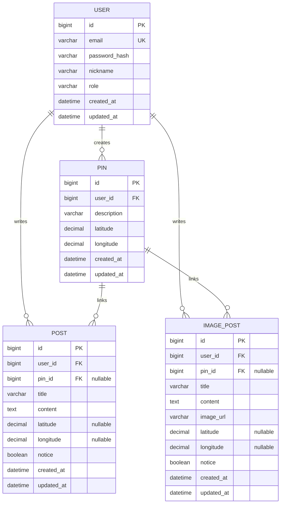

# ERD 설계 (초안)

본 ERD는 `doc/PRD.md`의 핵심 도메인(User, Post, ImagePost, Pin, Location)을 기준으로 한다.

## 엔티티 목록

- **User**: 회원(ROLE_USER/ROLE_ADMIN)
- **Post**: 일반 게시글
- **ImagePost**: 이미지 게시글
- **Pin**: 지도 Pin
- **Location**: 위도/경도 Value Object

## 관계 요약 (확정)

- User 1:N Post
- User 1:N ImagePost
- User 1:N Pin
- **Pin 1:N Post** (게시글이 Pin을 참조할 수 있음, nullable)
- **Pin 1:N ImagePost** (nullable)

## ERD (Mermaid)

## 컬럼/정책 메모

- **Location(Value Object)**
  - DB 저장은 `latitude`, `longitude` 2개 컬럼 또는 Embeddable로 표현
  - 좌표 precision은 서비스 요구에 맞게 결정(예: DECIMAL(10,7))
- **공지(notice)**
  - 관리자 기능(공지 등록/해제)에 필요
  - 목록 조회 시 notice 우선 정렬 가능
- **감사(Audit) 컬럼**
  - created_at/updated_at은 공통 적용 권장

---

> 최종 업데이트: 2026-02-04

